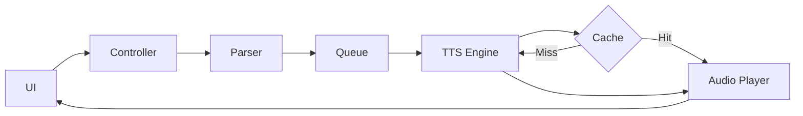

# Documentation Standards

> Comprehensive documentation guidelines for Go projects
> Focus on GoDoc, README structure, and architecture documentation

## Documentation Philosophy

### Core Principles
1. **Document the why, not the what** - Code shows what, docs explain why
2. **Examples over exposition** - Show, don't just tell
3. **Keep docs close to code** - Documentation should live with what it documents
4. **Automate when possible** - Generate docs from code
5. **Test your examples** - Ensure examples actually work

## GoDoc Conventions

### Package Documentation
```go
// Package tts provides text-to-speech functionality for the Glow markdown reader.
// It supports multiple TTS engines including Piper (offline) and Google TTS (cloud),
// with automatic fallback and caching capabilities.
//
// Basic usage:
//
//	engine := tts.NewEngine(tts.Config{
//	    Type: "piper",
//	    Model: "en_US-amy-medium",
//	})
//	defer engine.Close()
//	
//	audio, err := engine.Synthesize(context.Background(), "Hello, world!")
//	if err != nil {
//	    log.Fatal(err)
//	}
//
// The package provides:
//   - Multiple engine implementations
//   - Audio caching for performance
//   - Queue-based sentence processing
//   - Background service management
//
// For more details, see the individual type documentation.
package tts
```

### Type Documentation
```go
// TTSEngine defines the interface for text-to-speech engines.
// Implementations must be safe for concurrent use.
//
// Available implementations:
//   - PiperEngine: Offline TTS using ONNX models
//   - GoogleTTSEngine: Cloud-based Google Text-to-Speech
//   - FallbackEngine: Automatic failover between engines
//
// Example:
//
//	var engine TTSEngine
//	if offline {
//	    engine = NewPiperEngine(config)
//	} else {
//	    engine = NewGoogleTTSEngine(apiKey)
//	}
type TTSEngine interface {
    // Synthesize converts text to audio data.
    // The returned audio is in PCM format (16-bit, mono).
    // The sample rate depends on the engine configuration.
    //
    // The context can be used for cancellation:
    //
    //	ctx, cancel := context.WithTimeout(context.Background(), 10*time.Second)
    //	defer cancel()
    //	audio, err := engine.Synthesize(ctx, "Hello")
    //
    // Returns an error if synthesis fails or context is cancelled.
    Synthesize(ctx context.Context, text string) ([]byte, error)
    
    // GetInfo returns engine capabilities and configuration.
    GetInfo() EngineInfo
    
    // Close releases any resources held by the engine.
    // After Close, the engine should not be used.
    Close() error
}
```

### Function Documentation
```go
// ParseSentences splits markdown text into sentences for TTS processing.
// It handles markdown formatting, removing markup while preserving structure.
//
// The function:
//   - Strips markdown syntax (bold, italic, links)
//   - Preserves sentence boundaries
//   - Handles abbreviations and edge cases
//   - Filters out code blocks
//
// Example:
//
//	text := "This is **bold**. This is *italic*."
//	sentences := ParseSentences(text)
//	// Returns: ["This is bold.", "This is italic."]
//
// For more complex parsing needs, see ParseSentencesWithOptions.
func ParseSentences(text string) []string {
    // Implementation
}
```

### Constant Documentation
```go
// Priority levels for sentence processing.
// Higher priority sentences are processed first.
const (
    // PriorityLow is used for prefetching future content.
    PriorityLow Priority = iota
    
    // PriorityNormal is the default priority for sequential reading.
    PriorityNormal
    
    // PriorityHigh is used for user-requested jumps in content.
    PriorityHigh
    
    // PriorityImmediate bypasses the queue entirely.
    PriorityImmediate
)
```

### Error Documentation
```go
// Common errors returned by TTS operations.
var (
    // ErrEngineNotInitialized is returned when attempting to use an uninitialized engine.
    ErrEngineNotInitialized = errors.New("tts: engine not initialized")
    
    // ErrTextTooLong is returned when input text exceeds engine limits.
    // Check EngineInfo.MaxTextSize for the limit.
    ErrTextTooLong = errors.New("tts: text exceeds maximum length")
    
    // ErrNoVoiceAvailable is returned when no suitable voice is found.
    // This typically happens with language mismatches.
    ErrNoVoiceAvailable = errors.New("tts: no voice available for language")
)
```

## README Structure

### Standard README Template
```markdown
# Glow-TTS

> Terminal markdown reader with text-to-speech capabilities

[](https://goreportcard.com/report/github.com/user/glow-tts)
[](https://github.com/user/glow-tts/actions)
[](https://codecov.io/gh/user/glow-tts)
[](LICENSE)

## Features

- 🎯 **Offline TTS** - Use Piper for privacy-focused, offline synthesis
- ☁️ **Cloud TTS** - Google Text-to-Speech for highest quality
- 🔄 **Automatic Fallback** - Seamless switching between engines
- 🚀 **Background Processing** - Non-blocking audio generation
- 💾 **Smart Caching** - Reuse synthesized audio automatically
- 📖 **Markdown Support** - Full markdown rendering in terminal

## Quick Start

### Installation

```bash
# Using Go
go install github.com/user/glow-tts@latest

# Using Homebrew
brew install glow-tts

# Using Docker
docker run -it user/glow-tts
```

### Basic Usage

```bash
# Read a file with TTS
glow --tts README.md

# Use specific TTS engine
glow --tts piper document.md

# Browse and read files
glow --tts
```

## Configuration

Glow-TTS can be configured via `~/.config/glow/config.yml`:

```yaml
# TTS Configuration
tts:
  engine: piper  # or "google"
  voice: en_US-amy-medium
  speed: 1.0
  cache_dir: ~/.cache/glow-tts

# Piper Settings
piper:
  model_path: ~/.local/share/piper/models
  
# Google TTS Settings
google:
  api_key: ${GOOGLE_TTS_API_KEY}
  language: en-US
```

## Documentation

- [User Guide](docs/user-guide.md)
- [API Reference](https://pkg.go.dev/github.com/user/glow-tts)
- [Contributing](CONTRIBUTING.md)
- [Architecture](docs/architecture.md)

## Development

### Prerequisites

- Go 1.21+
- Piper (for offline TTS)
- Task (for build automation)

### Building

```bash
# Clone repository
git clone https://github.com/user/glow-tts
cd glow-tts

# Install dependencies
go mod download

# Build
go build

# Run tests
go test ./...

# Run with race detector
go test -race ./...
```

### Project Structure

```
glow-tts/
├── cmd/           # Command-line interface
├── internal/      # Internal packages
│   ├── tts/      # TTS engine implementations
│   ├── audio/    # Audio processing
│   └── queue/    # Sentence queueing
├── ui/           # Terminal UI components
├── docs/         # Documentation
└── test/         # Test fixtures and helpers
```

## Contributing

We welcome contributions! Please see [CONTRIBUTING.md](CONTRIBUTING.md) for guidelines.

## License

MIT - See [LICENSE](LICENSE) for details.
```

## Architecture Documentation

### Architecture Decision Records (ADR)
```markdown
# ADR-001: Background Service Architecture for TTS

## Status
Accepted

## Context
We need to add TTS capabilities to Glow without blocking the UI or degrading performance.
The TTS synthesis can be CPU-intensive and time-consuming.

## Decision
We will implement TTS as a background service that:
- Runs in a separate goroutine
- Communicates via channels
- Preprocesses upcoming sentences
- Manages its own lifecycle

## Consequences
### Positive
- UI remains responsive
- Can preprocess content for smooth playback
- Clean separation of concerns
- Easy to test in isolation

### Negative
- More complex state management
- Potential synchronization issues
- Additional memory overhead

## Alternatives Considered
1. **Inline Processing**: Too slow, blocks UI
2. **External Process**: More complex IPC, harder to manage
3. **Web Service**: Requires network, not offline-capable
```

### Component Documentation
```markdown
# TTS Component Architecture

## Overview
The TTS system consists of several interconnected components that work together
to provide seamless text-to-speech functionality.

## Components

### 1. TTS Controller
**Responsibility**: Orchestrates the entire TTS pipeline
**Location**: `internal/tts/controller.go`

The controller:
- Manages engine lifecycle
- Coordinates between components
- Handles state transitions
- Processes commands from UI

### 2. Sentence Parser
**Responsibility**: Breaks markdown into speakable sentences
**Location**: `internal/tts/parser.go`

Features:
- Markdown stripping
- Sentence boundary detection
- Code block filtering
- Abbreviation handling

### 3. Audio Queue
**Responsibility**: Manages preprocessing and playback order
**Location**: `internal/queue/audio_queue.go`

The queue:
- Maintains 2-3 sentence lookahead
- Prioritizes user navigation
- Handles memory management
- Provides backpressure

### 4. TTS Engines
**Responsibility**: Actual text-to-speech synthesis
**Location**: `internal/tts/engines/`

Implementations:
- **Piper**: Offline, ONNX-based
- **Google**: Cloud-based, high quality
- **Mock**: For testing

### 5. Audio Player
**Responsibility**: Platform-specific audio playback
**Location**: `internal/audio/player.go`

Features:
- Cross-platform support
- Non-blocking playback
- Position tracking
- Volume control

## Data Flow



## State Management

The system maintains several state machines:

### Controller State
- `Idle`: No TTS active
- `Initializing`: Starting up
- `Ready`: Can accept commands
- `Processing`: Generating audio
- `Playing`: Audio playback active
- `Paused`: Playback paused
- `Stopping`: Shutting down

### Queue State
- `Empty`: No items queued
- `Filling`: Accepting new items
- `Full`: At capacity
- `Draining`: Processing final items
```

## API Documentation

### OpenAPI/Swagger
```yaml
# If building HTTP API
openapi: 3.0.0
info:
  title: Glow-TTS API
  version: 1.0.0
  description: Text-to-Speech API for Glow

paths:
  /synthesize:
    post:
      summary: Synthesize text to speech
      requestBody:
        required: true
        content:
          application/json:
            schema:
              type: object
              required:
                - text
              properties:
                text:
                  type: string
                  maxLength: 5000
                voice:
                  type: string
                  default: "en_US-amy-medium"
                speed:
                  type: number
                  minimum: 0.5
                  maximum: 2.0
                  default: 1.0
      responses:
        '200':
          description: Audio data
          content:
            audio/wav:
              schema:
                type: string
                format: binary
        '400':
          description: Invalid request
        '500':
          description: Synthesis failed
```

## Example Documentation

### Runnable Examples
```go
// examples/basic/main.go
package main

import (
    "context"
    "log"
    
    "github.com/user/glow-tts/pkg/tts"
)

// Example demonstrates basic TTS usage
func Example() {
    // Create engine
    engine, err := tts.NewEngine(tts.Config{
        Type: "piper",
    })
    if err != nil {
        log.Fatal(err)
    }
    defer engine.Close()
    
    // Synthesize text
    audio, err := engine.Synthesize(
        context.Background(),
        "Hello, world!",
    )
    if err != nil {
        log.Fatal(err)
    }
    
    log.Printf("Generated %d bytes of audio", len(audio))
    // Output: Generated 44100 bytes of audio
}
```

## Testing Documentation

### Test Examples
```go
func ExampleTTSEngine_Synthesize() {
    engine := NewMockEngine()
    defer engine.Close()
    
    audio, err := engine.Synthesize(context.Background(), "Test")
    if err != nil {
        panic(err)
    }
    
    fmt.Printf("Audio length: %d", len(audio))
    // Output: Audio length: 8820
}
```

## Comments Best Practices

### Do Comment
- Package purpose and usage
- Complex algorithms
- Non-obvious decisions
- TODO items with issue links
- Deprecated features

### Don't Comment
- Obvious code
- Getter/setter mechanics
- Standard patterns
- Language features

### Comment Examples
```go
// Good: Explains why
// We use a ring buffer here to avoid frequent allocations
// during audio streaming, which can cause playback stuttering.
buffer := NewRingBuffer(1024 * 1024)

// Bad: States the obvious
// Set the name
func (u *User) SetName(name string) {
    u.name = name
}

// Good: Documents edge case
// ParseSentences handles markdown text. Note that code blocks
// are completely removed as they shouldn't be spoken.
// Use ParseSentencesWithCode if you need to preserve them.
```

## Documentation Tools

### Generate Documentation
```bash
# Generate GoDoc locally
godoc -http=:6060

# Generate markdown docs
gomarkdoc ./... > API.md

# Check documentation coverage
go-doc-coverage ./...

# Generate architecture diagrams
go-plantuml generate
```

### Documentation Linting
```yaml
# .golangci.yml
linters:
  enable:
    - godoc
    - misspell
    - godox  # Finds TODO/FIXME comments

linters-settings:
  godox:
    keywords:
      - TODO
      - FIXME
      - BUG
```

---

*Clear documentation is as important as clean code.*